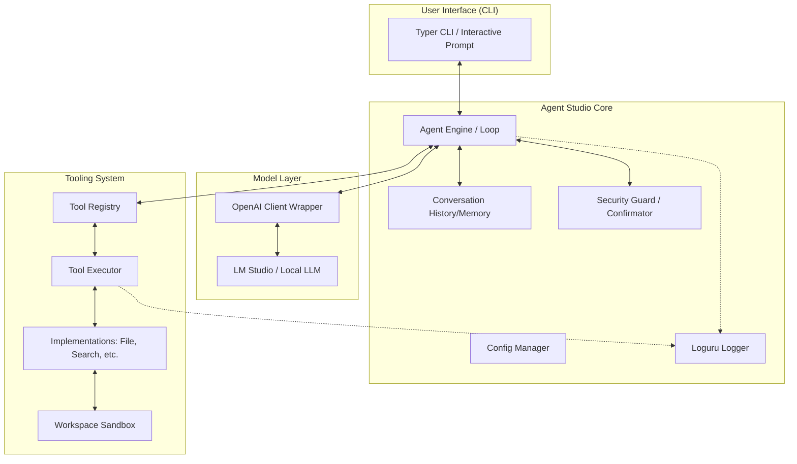

# Local Agent Studio - Project Specification & Roadmap

## 项目目标
开发一个可连接 LM Studio 本地模型的 Agent 框架，支持多轮对话、工具调用、工具扩展、用户确认、日志记录和测试。

## 技术约束
- **语言**: Python 3.11+
- **模型对接**: 使用 OpenAI Python SDK 连接 LM Studio (http://localhost:1234/v1)
- **交互方式**: 初期为 CLI，预留 Web UI 可能
- **工具系统**: 模块化设计，支持动态发现
- **核心逻辑**: 不依赖云端完成推理，严格控制工具执行流（非信任模型输出）

---

## Phase 0: 需求澄清与技术选型

### 产品需求拆解
1.  **连接层 (Connectivity)**: 实现对 OpenAI 兼容 API 的稳定连接，支持环境变量配置，具备健康检查。
2.  **推理引擎 (Inference Engine)**: 封装多轮对话上下文管理，解析并处理模型输出的 Function Calling 指令。
3.  **工具系统 (Tooling System)**: 
    - **注册中心**: 支持插件式加载，支持动态发现。
    - **执行器**: 执行逻辑、参数验证、错误捕获及结果反馈。
    - **沙箱/权限控制**: 文件访问限制在指定 workspace 内，高风险操作需用户确认。
4.  **Agent 核心循环 (Agent Loop)**: 实现 `思考 -> 判断 -> 工具调用 $\rightarrow$ 观察结果 $\rightarrow$ 再思考` 的闭环逻辑。
5.  **可观测性 (Observability)**: 全链路日志记录（对话、工具参数、执行流）。

### 技术栈选择
| 技术 | 选择 | 原因 |
| :--- | :--- | :--- |
| **语言** | Python 3.11+ | 类型检查支持，生态丰富。 |
| **LLM SDK** | OpenAI Python SDK | 标准接口，便于更换底层模型提供商。 |
| **数据验证** | Pydantic (v2) | 定义工具 Input Schema，确保参数合法性。 |
| **配置管理** | Pydantic-settings | 优雅处理 `.env` 和环境变量。 |
| **CLI 工具** | Typer | 基于 Type Hint 的现代 CLI 开发框架。 |
| **日志系统** | Loguru | 提供丰富的功能和简单的 API 记录过程。 |
| **测试框架** | Pytest | 成熟的测试生态，支持异步验证。 |

---

## Phase 1: 系统架构与接口设计

### 系统架构图 (Mermaid)


### 项目目录结构
```text
local_agent_studio/
├── .env                    # 环境变量 (API_BASE, MODEL_NAME)
├── pyproject.toml          # 依赖管理
├── src/
│   ├── __init__.py
│   ├── main.py             # CLI 入口
│   ├── agent/              # Agent 核心逻辑
│   │   ├── engine.py       # Agent Loop 实现
│   │   ├── model_client.py # 模型交互封装
│   │   └── memory.py       # 对话历史管理
│   ├── tools/              # 工具系统
│   │   ├── base.py         # BaseTool 基类定义
│   │   ├── registry.py     # 工具注册器
│   │   └── implementations/ # 具体工具实现 (file_tool.py等)
│   ├── core/               # 核心基础设施
│   │   ├── config.py       # 配置加载
│   │   ├── exceptions.py   # 自定义异常
│   │   ├── security.py     # 安全检查与用户确认逻辑
│   │   └── workspace.py    # 工作目录沙箱管理
│   └── utils/              # 辅助工具
│       ├── logger.py       # 日志配置
├── tests/                  # 测试用例 (unit, integration)
└── logs/                   # 日志文件存储
```

### 核心接口设计
- **ModelClient**: `chat_completion(messages: List[Dict])`, `check_health()`。
- **BaseTool**: 包含 `name`, `description`, `input_schema` (Pydantic), 和 `execute(**kwargs)`。
- **AgentEngine**: `run_step(user_input: str) -> AgentResponse`。

### Agent Loop 设计逻辑
1.  **输入接收**: 解析用户输入并加入到历史记录中。
2.  **模型推演**: 请求 LLM 决定是直接回答还是调用工具。
3.  **工具决策**: 若判定为 Tool Call：
    - **安全检查**: `SecurityGuard` 判断是否需要人工确认。
    - **参数验证**: Pydantic 解析并校验请求参数。
    - **执行与观察**: `ToolExecutor` 执行任务，并将结果反馈给模型。
4.  **循环/终止**: 递归或循环此过程直到满足退出条件（如模型给出最终结论）。

### 安全风险清单
| 风险项 | 级别 | 缓解策略 |
| :--- | :--- | :--- |
| **路径穿越** | 高 | `WorkspaceManager` 对所有文件操作强制进行 Path 解析。 |
| **任意命令执行** | 极高 | 初期禁止相关工具；后续涉及 shell 的工具必须经由人工二次确认。 |
| **参数注入** | 中 | 使用 Pydantic 进行强类型校验，拒绝非预期类型的输入。 |
| **死循环** | 中 | 设置 `max_iterations` 硬限制 Agent 思考次数。 |

---

## 开发路线图
- **Phase 2**: 项目骨架建立与基础 ModelClient 对话实现。
- **Phase 3**: 工具注册系统构建与简单 File Read 工具开发。
- **Phase 4**: 实现核心 Agent Loop 与工具自动调用逻辑。
- **Phase 5**: 加入安全防护机制（用户确认、路径沙箱）。
- **Phase 6**: 日志完善、异常处理增强及集成测试覆盖。
- **Phase 7**: 文档生成与案例展示。
